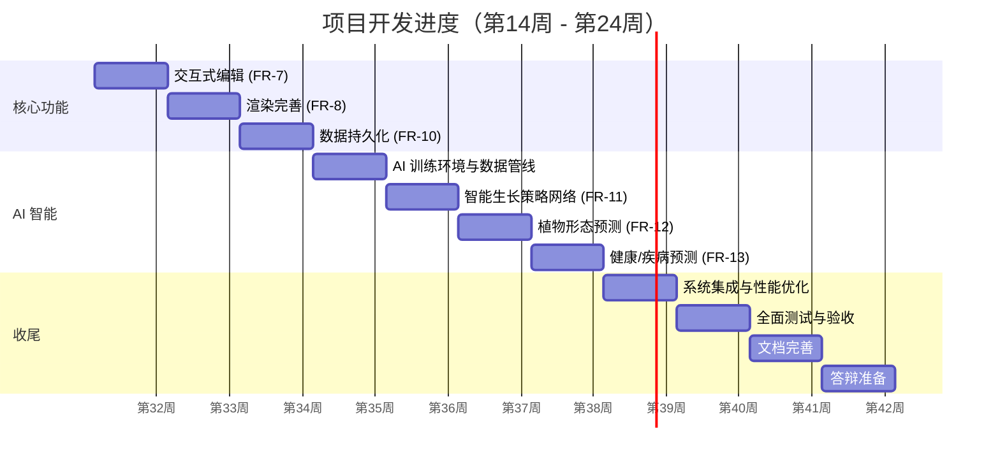

# 项目开发进度计划（第 14 周起）

| 文档版本 | V1.0 |
| --- | --- |
| 编写日期 | 2026-08-09 |
| 编写依据 | 《需求分析文档》《详细设计文档》与第 4–13 周迭代记录 |

---

## 一、项目当前进展总览

### 1.1 已完成里程碑（第 4–16 周）

| 周次 | 主题 | 主要交付 | 对应需求 |
| --- | --- | --- | --- |
| 第 4 周 | 植物数据结构 | `PlantNode` / `PlantModel` / 枝干·叶片·根系 / JSON 序列化 | FR-1 |
| 第 5 周 | L-System 骨架生成 | 字符串重写、三维海龟解释器、四类预设 | FR-1 |
| 第 6 周 | Metaball 隐式曲面 | 点源/线段源、标量场、AABB | FR-3 |
| 第 7 周 | Marching Cubes | 网格提取、法向、水密性检查、Taubin 平滑、LOD | FR-4 |
| 第 8 周 | 模型优化与叶片 | 顶点去重、退化剔除、叶片网格与朝向 | FR-1/FR-3 |
| 第 9 周 | 生长时间模型 | 生长时钟、时间轴、阶段阈值、连续尺度 | FR-2 |
| 第 10 周 | 动态分枝生成 | 分枝规则、叶片萌发、资源与层级约束 | FR-2 |
| 第 11 周 | 向光性与向地性 | 多光源、遮挡近似、环境向性 | FR-5 |
| 第 12 周 | 生长数据记录与回放 | `GrowthDataRecorder`、时间轴、曲线、导出 | FR-2/FR-10 |
| 第 13 周 | 植物物理模型 | PBD 质量点、长度/弯曲/夹角约束、风力、调试可视化 | FR-5 |
| 第 14 周 | 交互式编辑 | 拾取、四类编辑工具、网格重建、撤销与重置 | FR-7 |
| 第 16 周 | 数据持久化与场景管理 | 预设/场景归档、记录点恢复、完整 OBJ/MTL 导出 | FR-10 |

### 1.2 需求覆盖对照

| 需求 | 名称 | 优先级 | 当前状态 | 计划周次 |
| --- | --- | --- | --- | --- |
| FR-1 | 三维植物生成 | 高 | ✅ 已完成 | 第 4–5、8 周 |
| FR-2 | 植物生长模拟 | 高 | ✅ 已完成 | 第 9–10、12 周 |
| FR-3 | 隐式曲面建模 | 高 | ✅ 已完成 | 第 6 周 |
| FR-4 | Marching Cubes 网格提取 | 高 | ✅ 已完成 | 第 7 周 |
| FR-5 | 物理约束模拟 | 高 | ✅ 已完成 | 第 11、13 周 |
| **FR-6** | **智能生长决策** | 中 | ⬜ 未开始 | 第 18 周 |
| **FR-7** | **交互式编辑** | 高 | ⬜ 未开始 | 第 14 周 |
| **FR-8** | **三维实时渲染** | 高 | 🟡 部分（Phong/摄像机） | 第 15 周 |
| FR-9 | 场景与摄像机控制 | 中 | 🟡 基本完成 | 第 15 周完善 |
| **FR-10** | **数据持久化** | 低 | ✅ 已完成 | 第 12、16 周 |
| **FR-11** | **AI 智能生长策略网络** | 高 | ⬜ 未开始 | 第 18 周 |
| **FR-12** | **AI 植物形态预测** | 高 | ⬜ 未开始 | 第 19 周 |
| **FR-13** | **AI 植物健康/疾病预测** | 高 | ⬜ 未开始 | 第 20 周 |

> 图例：✅ 已完成　🟡 部分完成　⬜ 未开始

### 1.3 剩余技术前置

| 前置项 | 说明 | 计划接入周 |
| --- | --- | --- |
| ONNX Runtime | `third_party` 引入 1.17+ C++ API | 第 17 周 |
| Python + PyTorch | 离线训练环境（Python 3.9+ / PyTorch 2.x） | 第 17 周 |
| 训练数据生产 | 复用第 12 周回放存档作为监督数据来源 | 第 17 周 |

---

## 二、开发计划总览（第 14–24 周）

> 说明：周次以相对迭代为主，具体日历日期可按实际推进顺延调整。

---

## 三、各周详细计划

### 第 14 周：交互式编辑（FR-7）

**本周目标**：实现鼠标驱动的植物结构编辑能力，覆盖拾取、拉伸、弯曲、旋转与节点级参数编辑，编辑后网格平滑重建且支持撤销/重置。

**任务分解**：

| 编号 | 任务 | 说明 |
| --- | --- | --- |
| 14-1 | 屏幕射线生成与节点拾取 | 由鼠标坐标反算世界射线，对 `PlantModel` 枝干节点/叶片做球体-射线求交；提供 `EditPickResult`（命中节点、最近距离、是否整株）。 |
| 14-2 | 拾取高亮与视口反馈 | 命中节点以高亮 Gizmo 显示，支持切换"节点级 / 整株级"拾取。 |
| 14-3 | 拉伸工具 | 对选定子树执行 Scale 变换，联动更新子节点位置、枝干长度与半径。 |
| 14-4 | 弯曲工具 | 以样条曲线对枝条做弯曲变形，逐节点重新投影到曲线。 |
| 14-5 | 旋转工具 | 以四元数对选定部分绕拾取轴旋转。 |
| 14-6 | 节点参数编辑 | 修改节点角度、长度、半径、叶片密度，面板实时反馈。 |
| 14-7 | 编辑后重建 | 编辑完成后重建 Metaball 场与 Marching Cubes 网格，保证无明显破面。 |
| 14-8 | 撤销 / 重置 | 快照式撤销栈，支持撤销上次编辑或重置为初始形态。 |
| 14-9 | 前端工具面板 | Web 控制台增加编辑工具切换与参数控制，通过 WebSocket 下发编辑指令。 |
| 14-10 | 回归程序 `PlantEditDemo` | 无 GUI 场景下验证拾取与各编辑变换的数值正确性。 |

**验收标准**（对照 FR-7.3）：

- 四种编辑操作均可实时生效并可视化。
- 编辑后网格平滑重建，无明显破面。
- 拾取准确率高，近距离拾取正确。

**交付物**：`src/Editing/`（拾取与编辑工具）、`SimulationEngine` 编辑槽函数、WebSocket 编辑协议、`PlantEditDemo`、第 14 周周报文档。

---

### 第 15 周：三维渲染完善（FR-8 / FR-9）

**本周目标**：在现有 Phong + 摄像机基础上补齐 PBR 材质、深度阴影、材质切换、Compute Shader 加速采样与性能统计，使渲染质量与性能达到验收标准。

**任务分解**：

| 编号 | 任务 | 说明 |
| --- | --- | --- |
| 15-1 | PBR 材质管线 | 金属度、粗糙度、基色、AO 贴图/参数；Cook-Torrance BRDF。 |
| 15-2 | 深度贴图阴影 | 方向光级联或单张深度图，PCF 软阴影；消除痤疮与闪烁。 |
| 15-3 | 材质切换 | Phong / PBR 一键切换、颜色调节。 |
| 15-4 | Compute Shader 采样 | 用 4.3 Compute Shader + SSBO 在 GPU 并行求值 Metaball 场（创新点 5）。 |
| 15-5 | 视口性能显示 | 实时显示 FPS、节点数、三角形数、采样耗时。 |
| 15-6 | 摄像机完善 | 轨道旋转/缩放/平移/复位的平滑过渡与碰撞避免；视角无翻转异常。 |
| 15-7 | 前端渲染控制 | 材质、阴影、环境光、背景等控制项接入 Web 控制台。 |

**验收标准**（对照 FR-8.3 / FR-9.2）：

- 中等复杂度场景帧率 ≥ 30 FPS。
- 阴影与光照效果正常，无闪烁或痤疮。
- 摄像机操作平滑无卡顿，视角无翻转异常。

**交付物**：PBR/阴影着色器、GPU 采样模块、性能面板、第 15 周周报文档。

---

### 第 16 周：数据持久化与场景管理（FR-10）

**本周目标**：把第 12 周的单向导出扩展为完整的"保存—载入—恢复"闭环，并补齐 OBJ 场景导出。

**完成状态**：✅ 已完成。实现 `plantsim.preset` / `plantsim.scene`、记录反序列化、场景恢复、完整 OBJ/MTL 导出、WebSocket 协议和前端文件入口，详见[第 16 周周报](第16周-数据持久化与场景管理.md)。

**任务分解**：

| 编号 | 任务 | 说明 |
| --- | --- | --- |
| 16-1 | 预设保存 | 植物参数 + 环境参数 → 配置文件（JSON）。 |
| 16-2 | 预设载入 | 载入配置文件，重建植物、环境与曲面。 |
| 16-3 | 场景导出 | 植物网格 + 叶片 → 完整 OBJ/MTL 导出，可在主流三维软件打开。 |
| 16-4 | 场景恢复 | 结合第 12 周存档，从任意时间步恢复完整场景（结构+环境+播放状态）。 |
| 16-5 | 前端持久化入口 | 保存/载入/导出按钮与文件选择集成。 |

**验收标准**（对照 FR-10.2）：

- 保存后可完整恢复植物形态与环境设置。
- 导出的 OBJ 文件可被主流三维软件打开。

**交付物**：预设管理模块、场景导出/载入接口、第 16 周周报文档。

---

### 第 17 周：AI 训练环境与数据生产管线

**本周目标**：搭建 Python 训练环境，构建可复用的数据生成与数据集管理管线，为三个 AI 模型提供监督数据。

**任务分解**：

| 编号 | 任务 | 说明 |
| --- | --- | --- |
| 17-1 | 训练环境搭建 | 安装 PyTorch 2.x、NumPy、onnx / onnxruntime；编写 requirements.txt。 |
| 17-2 | 数据生成器 | 批量运行模拟器（多种子 × 多环境参数），输出"环境参数+植物状态 → 生长策略"样本。 |
| 17-3 | 形态序列数据 | 复用第 12 周回放存档生成"初始状态+环境序列 → 未来形态"时序样本。 |
| 17-4 | 健康/疾病样本 | 注入缺水、缺肥、极端温度等异常生成带标签样本。 |
| 17-5 | 数据集管理 | 统一的 HDF5/Parquet 数据集格式、划分训练/验证/测试集。 |

**验收标准**：

- 生成样本量满足训练下限（策略 ≥ 10k，形态 ≥ 5k 序列，健康 ≥ 3k）。
- 数据集可被三个训练脚本一致读取。

**交付物**：`python/` 训练目录、数据生成器、数据集格式文档。

---

### 第 18 周：AI 智能生长策略网络（FR-11 / FR-6）

**本周目标**：实现策略网络（GNN/MLP）预测最优生长策略，完成 PyTorch 训练、ONNX 导出与 C++ 端实时推理，并支持"规则 / AI"双模式切换。

**任务分解**：

| 编号 | 任务 | 说明 |
| --- | --- | --- |
| 18-1 | 特征与标签定义 | 输入：环境参数 + 植物局部状态；输出：方向、分枝数、枝长、叶片密度。 |
| 18-2 | 模型实现与训练 | PyTorch 实现，训练并评估（对照 FR-11 验收）。 |
| 18-3 | ONNX 导出 | 导出量化/半精度 ONNX，控制推理延迟 < 16ms。 |
| 18-4 | C++ 推理接入 | ONNX Runtime 会话管理、张量编解码；抽象 `INeuralGrowthPolicy` 接口。 |
| 18-5 | 策略切换与模型管理 | "规则 / AI" 模式切换；模型加载/卸载/切换。 |
| 18-6 | 前端 AI 控制 | 模式切换、模型选择、策略可视化（预测方向箭头等）。 |
| 18-7 | 回归程序 `AINeuralGrowthDemo` | 无 GUI 验证推理链路与延迟。 |

**验收标准**（对照 FR-11.3）：

- AI 模式下植物随光照方向主动调整生长，形态与规则模式存在合理差异。
- 单次策略推理延迟 < 16ms。

**交付物**：策略网络训练脚本、ONNX 模型、C++ 推理模块、第 18 周周报文档。

---

### 第 19 周：AI 植物形态预测（FR-12）

**本周目标**：实现基于 LSTM/RNN 的形态时序预测模型，在前端以半透明/线框方式叠加显示"生长预览"。

**任务分解**：

| 编号 | 任务 | 说明 |
| --- | --- | --- |
| 19-1 | 时序模型实现 | LSTM 编码初始状态 + 环境序列，解码未来 T 时刻节点位置/拓扑/长度/半径。 |
| 19-2 | 训练与评估 | 以节点平均位置误差为指标，目标 < 8%。 |
| 19-3 | ONNX 导出与 C++ 推理 | 复用第 18 周推理框架接入形态模型。 |
| 19-4 | 生长预览渲染 | 半透明/线框叠加显示预测形态，不阻塞实时交互。 |
| 19-5 | 前端预览控制 | 设置预测时长 T、切换预览开关。 |

**验收标准**（对照 FR-12.3）：

- 预测形态与实际模拟形态的节点平均位置误差 < 8%。
- 预览显示不阻塞实时交互。

**交付物**：形态预测模型与训练脚本、预览渲染、第 19 周周报文档。

---

### 第 20 周：AI 健康/疾病预测（FR-13）

**本周目标**：实现健康评分（0~1）回归与疾病风险（低/中/高）分类，结合资源与环境异常给出预警并在视口可视化。

**任务分解**：

| 编号 | 任务 | 说明 |
| --- | --- | --- |
| 20-1 | 模型实现 | 多任务网络：健康分回归 + 风险分类；输入为状态与环境时序。 |
| 20-2 | 训练与 ONNX 导出 | 病态样本训练，导出 ONNX。 |
| 20-3 | C++ 推理接入 | 健康分与风险等级实时计算。 |
| 20-4 | 异常检测 | 水分/营养/温度异常判定与提示。 |
| 20-5 | 可视化 | 视口按健康分着色、面板图标/颜色提示。 |
| 20-6 | 前端健康面板 | 健康分进度条、风险等级、异常列表。 |

**验收标准**（对照 FR-13.3）：

- 健康分数随资源下降而降低，趋势合理。
- 疾病预警在长期干旱等触发条件下正确触发。

**交付物**：健康预测模型、健康面板、第 20 周周报文档。

---

### 第 21 周：系统集成与性能优化

**本周目标**：将编辑、渲染、持久化与 AI 全部功能联调集成，围绕 30 FPS 与稳定性做系统级优化。

**任务分解**：

| 编号 | 任务 | 说明 |
| --- | --- | --- |
| 21-1 | 全链路集成 | 编辑→物理→生长→曲面→AI→回放 各模块协同联调。 |
| 21-2 | 性能分析 | Profiling 定位 CPU/GPU 热点（生长、采样、网格重建）。 |
| 21-3 | 空间加速 | 隐式场八叉树加速、Metaball 增量更新。 |
| 21-4 | 渲染优化 | LOD 切换、实例化叶片、按需重绘（已有基础）进一步精简。 |
| 21-5 | 稳定性 | 长时运行内存/句柄泄漏检测、异常输入防护。 |
| 21-6 | 前端最终打磨 | 布局、主题、交互细节与错误反馈。 |

**验收标准**：

- 综合演示场景帧率 ≥ 30 FPS。
- 连续生长 30 年过程无崩溃、无发散。

**交付物**：集成版本、性能报告、第 21 周周报文档。

---

### 第 22 周：全面测试与验收

**本周目标**：按《需求分析文档》验收标准逐项核对，补齐单元测试与集成测试，修复遗留缺陷。

**任务分解**：

| 编号 | 任务 | 说明 |
| --- | --- | --- |
| 22-1 | 单元测试 | 覆盖数据结构、L-System、隐式场、网格、物理、记录器、编辑工具。 |
| 22-2 | 集成测试 | WebSocket 协议全流程、AI 推理链路、保存/载入闭环。 |
| 22-3 | 验收核对 | FR-1~FR-13 验收标准逐条验证并记录结果。 |
| 22-4 | 缺陷修复 | 汇总并修复测试暴露问题。 |
| 22-5 | 回归确认 | `git diff --check`、构建与运行冒烟验证。 |

**验收标准**：需求文档所列验收项全部通过或给出合理说明。

**交付物**：测试报告、缺陷清单与修复记录、第 22 周周报文档。

---

### 第 23 周：文档完善

**本周目标**：完成毕业设计配套文档，形成可评审、可复现的交付材料。

**任务分解**：

| 编号 | 任务 | 说明 |
| --- | --- | --- |
| 23-1 | 详细设计更新 | 补充编辑、渲染、AI 三章设计与接口。 |
| 23-2 | 用户操作手册 | 安装、运行、演示步骤。 |
| 23-3 | 测试报告 | 汇总第 22 周测试结论。 |
| 23-4 | 代码注释与 README | 关键算法注释、运行说明、目录结构更新。 |

**交付物**：全套毕业设计文档更新。

---

### 第 24 周：答辩准备

**本周目标**：准备演示与答辩材料，进行多轮预演。

**任务分解**：

| 编号 | 任务 | 说明 |
| --- | --- | --- |
| 24-1 | 演示脚本 | 生成→生长→编辑→物理→AI 预测→回放 完整演示流程。 |
| 24-2 | 演示视频 | 录制高清演示视频（含关键阶段与 AI 对比）。 |
| 24-3 | 答辩 PPT | 创新点、架构、成果、数据可视化。 |
| 24-4 | 预演 | 多轮答辩预演，准备问答。 |

**交付物**：演示脚本、视频、答辩 PPT。

---

## 四、里程碑与交付物清单

| 里程碑 | 达成周 | 关键交付 |
| --- | --- | --- |
| M1 交互编辑可用 | 第 14 周 | 编辑工具、拾取、撤销/重置 |
| M2 渲染达标 | 第 15 周 | PBR、阴影、GPU 采样、性能面板 |
| M3 数据闭环 | 第 16 周 | 预设保存/载入、场景导出 |
| M4 AI 训练管线就绪 | 第 17 周 | PyTorch 环境、数据集 |
| M5 三大 AI 模型接入 | 第 18–20 周 | 策略/形态/健康 ONNX + C++ 推理 |
| M6 集成稳定版 | 第 21 周 | 全功能联调、性能达标 |
| M7 测试验收通过 | 第 22 周 | 测试报告、缺陷清零 |
| M8 文档与答辩就绪 | 第 23–24 周 | 全套文档、演示、PPT |

---

## 五、风险管理

| 风险 | 影响 | 应对 |
| --- | --- | --- |
| ONNX Runtime 与 Qt/MSVC 环境兼容问题 | 阻塞 AI 接入 | 第 17 周提前做最小推理冒烟验证；备选：动态库加载 + 失败降级规则模式。 |
| AI 模型精度不达验收（形态 <8%） | 影响 FR-12 | 数据规模与质量优先；备选简化标签口径并给出误差统计说明。 |
| 交互编辑破坏网格/物理稳定性 | 影响编辑体验 | 编辑后强制重建曲面 + 物理同步，提供撤销保护。 |
| 性能不达 30 FPS | 影响 FR-8 | LOD、GPU 采样、增量重建三级优化；必要时降级曲面分辨率。 |
| 时间紧张 | 影响全部 | 各周末保留半天缓冲，优先级顺序执行（编辑→渲染→AI）。 |

---

## 六、每周例行流程

1. **周一**：明确本周目标与任务分解，更新本计划文档。
2. **周二–周四**：核心开发与联调。
3. **周五**：构建验证（MSBuild + 前端 `npm run build`）、冒烟测试、`git diff --check`。
4. **周五**：撰写本周周报（新增至 `docs/第N周-*.md`），更新需求覆盖对照表。
